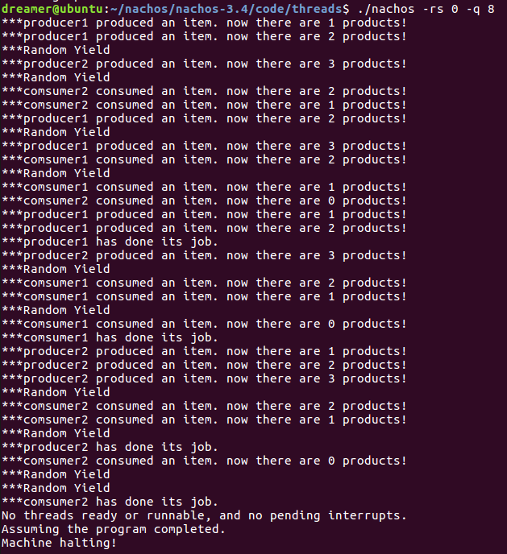
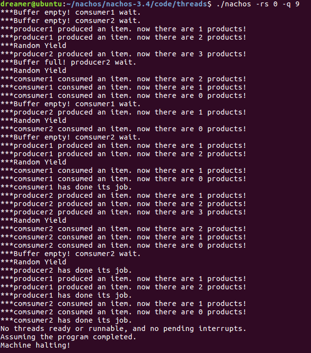
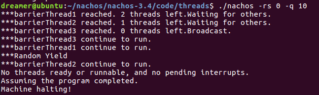
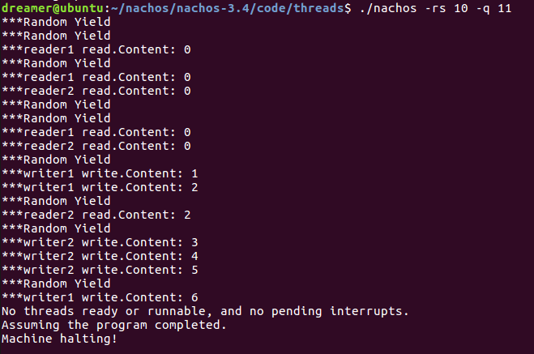

# 同步机制实习报告


[TOC]

## 内容一：总体概述

本次实验通过修改nachos源码用信号量来实现锁和条件变量，并利用它们实现同步和互斥机制应用实例，深入理解操作系统的同步机制。

## 内容二：任务完成情况

### 任务完成列表（Y/N）

| Exercise1      | Exercise2      | Exercise3      | Exercise4 |
| -------------- | -------------- | -------------- | --------- |
| Y              | Y              | Y              | Y         |
| **Chanllege2** | **Chanllege2** | **Chanllege3** |           |
| Y              | Y              | N              |           |

### 具体Exercise的完成情况

#### 第一部分、TLB异常处理

#####Exercise 1 调研

**调研Linux中实现的同步机制。具体内容见课堂要求。**

Linux实现了原子操作、自旋锁、读写自旋锁、信号量、读写信号量、互斥量、完成变量、顺序锁、禁止抢占、顺序和屏障等同步机制。

- 原子操作

  > 保证一个线程的操作不会被打断。

- 自旋锁

  > 自旋锁的特点是当一个线程获取了锁之后，其他试图获取这个锁的线程一直在循环等待获取这个锁，直至锁重新可用。

- 读写自旋锁

  > 读写自旋锁除了由普通自选锁之外的特性之外还有以下特点：
  >
  > - 读锁之间是共享的
  > - 写锁之间是互斥的
  > - 读锁和写锁之间是互斥的

- 信号量

  > 线程在使用共享资源时通过信号量进行申请(P)和释放(V)操作，在申请失败时，线程会在这个信号量的等待队列中进入睡眠。

- 读写信号量

  > 区分读写特性的信号量。

- 互斥量

  > 互斥量的使用比二值信号量严格，如下
  >
  > 1. mutex 计数值只能为 1，也就是说最多允许一个线程访问临界区。
  > 2. 必须在同一个上下文问加锁和解锁。
  > 3. 不能递归的上锁和解锁。
  > 4. 持有 mutex 时，进程不能退出。
  > 5. mutex 不能在中断或者下半部使用，也就是 mutex 只能在进程上下文中使用。

- 完成变量

  > 完成变量类似于信号量，当线程完成任务出了临界区之后，使用完成变量唤醒等待线程（更像 condition）。

- 大内核锁

  > 一个粗粒度锁，Linux 过度到细粒度锁之前版本使用

- 顺序锁

  > 顺序锁的特点是，读锁被获取的情况下，写锁仍然可以被获取。
  >
  > 使用顺序锁的读操作在读之前和读之后都会检查顺序锁的序列值。如果前后值不服，这说明在读的过程中有写的操作发生。那么该操作会**重新执行一次，直至读前后的序列值是一样**的。

- 禁止抢占

  > 只关闭抢占而不关闭中断

- 顺序和屏障

  > 防止编译器优化我们的代码，导致我们代码的执行顺序与我们所写的不同。

#####Exercise2 源代码阅读

**阅读下列源代码，理解Nachos现有的同步机制。**

- threads/synch.h和threads/synch.cc

  > 声明了Semaphore、Lock、Condition三个类，并对Semaphore作了定义。
  >
  > - Semaphore：定义value变量和P、V函数
  >   - P()：当value等于0时，将当前运行线程放入线程等待队列，当前进程进入睡眠状态，；当value大于0时，value减一。
  >   - V()：如果线程等待队列中有等待该信号量的线程，取出其中一个将其设置成就绪态，value加一。
  > - Lock：Nachos中没有给出锁机制的实现，接口有Acquire和Release。
  >   - Acquire：当锁处于BUSY态，进入睡眠状态。当锁处于FREE态，当前进程获得该锁，继续运行。
  >   - Release：释放锁（只能由拥有锁的线程才能释放锁），将锁的状态设置为FREE态，如果有其他线程等待该锁，将其中的一个唤醒，进入就绪态。
  > - Condition：Nachos中没有给出条件变量的实现，接口有 Wait、Signal 以及 BroadCast
  >   - Wait(Lock *conditionLock)：线程等待在条件变量上，把线程放入条件变量的等待队列上。
  >   - Signal(Lock *conditionLock)：从条件变量的等待队列中唤醒一个等待该条件变量的线程。
  >   - BroadCast(Lock *conditionLock)：唤醒所有等待该条件变量的线程。

- threads/synchlist.h和threads/synchlist.cc

  > 利用锁和条件变量实现的一个消息队列类Synchlist，实现了以下函数
  >
  > - Append(void *item)：在队列尾插入item。
  > - Remove：从队列头删除元素。
  > - Mapcar(VoidFunctionPtr func)： 以func为参数调用队列的Mapcar方法。

##### Exercise3 实现锁和条件变量

**可以使用sleep和wakeup两个原语操作（注意屏蔽系统中断），也可以使用Semaphore作为唯一同步原语（不必自己编写开关中断的代码）。**

本次实验采用信号量来实现锁和条件变量。

锁可以用初值为1的信号量实现，在Lock类中添加成员变量Thread* holder和Semaphore* lock。实现如下

```
Lock::Lock(char* debugName) {
    name=debugName;
    lock=new Semaphore(name,1);
    holder=NULL;
}
Lock::~Lock() {
    delete lock;
}
void Lock::Acquire() {
    IntStatus oldLevel=interrupt->SetLevel(IntOff);
    lock->P();
    holder=currentThread;
    (void)interrupt->SetLevel(oldLevel);
}
void Lock::Release() {
    IntStatus oldLevel=interrupt->SetLevel(IntOff);
    ASSERT(holder==currentThread);
    lock->V();
    holder=NULL;
    (void)interrupt->SetLevel(oldLevel);
}
bool Lock::isHeldByCurrentThread(){
    return currentThread==holder;
}
```

条件变量的实现需要在Condition类中增加队列成员变量List *queue，实现如下

```
Condition::Condition(char* debugName) {
    name = debugName;
    queue=new List();
}
Condition::~Condition() { 
    delete queue;
}
void Condition::Wait(Lock* conditionLock) { 
    IntStatus oldLevel=interrupt->SetLevel(IntOff);
    ASSERT(conditionLock->isHeldByCurrentThread());
    conditionLock->Release();
    queue->Append(currentThread);
    currentThread->Sleep();
    conditionLock->Acquire();
    (void)interrupt->SetLevel(oldLevel);
}
void Condition::Signal(Lock* conditionLock) { 
    IntStatus oldLevel=interrupt->SetLevel(IntOff);
    ASSERT(conditionLock->isHeldByCurrentThread());
    if(!queue->IsEmpty()){
        Thread *t=(Thread *)queue->Remove();
        scheduler->ReadyToRun(t);
    }
    (void)interrupt->SetLevel(oldLevel);
}
void Condition::Broadcast(Lock* conditionLock) { 
    IntStatus oldLevel=interrupt->SetLevel(IntOff);
    ASSERT(conditionLock->isHeldByCurrentThread());
    while(!queue->IsEmpty()){
        Thread *t=(Thread *)queue->Remove();
        scheduler->ReadyToRun(t);
    }
    (void)interrupt->SetLevel(oldLevel);
}
```

##### Exercise 4 实现同步互斥实例

**基于Nachos中的信号量、锁和条件变量，采用两种方式实现同步和互斥机制应用（其中使用条件变量实现同步互斥机制为必选题目）。具体可选择“生产者-消费者问题”、“读者-写者问题”、“哲学家就餐问题”、“睡眠理发师问题”等。（也可选择其他经典的同步互斥问题）**

本次实验选择生产者-消费者问题，缓冲池大小设为N=3，提供两个生产者线程和两个消费者线程，它们的任务量如下表

| consumer1 | consumer2 | producer1 | producer2 |
| --------- | --------- | --------- | --------- |
| 5         | 6         | 6         | 5         |

基于信号量实现如下：

```
int products,N;
Semaphore *empty,*full,*mutex;
void producerUsingSemaphore(int which){
    for(int i=0;i<which;i++){
        //produce
        interrupt->SetLevel(IntOff);
        interrupt->SetLevel(IntOn);

        empty->P();
        mutex->P();
        products++;
        printf("***%s produced an item. now there are %d products!\n",
        currentThread->getName(),products);
        mutex->V();
        full->V();
    }
    printf("***%s has done its job.\n",currentThread->getName());

}
void consumerUsingSemaphore(int which){
    for(int i=0;i<which;i++){
        full->P();
        mutex->P();
        products--;
        printf("***%s consumed an item. now there are %d products!\n",
        currentThread->getName(),products);
        mutex->V();
        empty->V();
        //consume
        interrupt->SetLevel(IntOff);
        interrupt->SetLevel(IntOn);
        

    }
    printf("***%s has done its job.\n",currentThread->getName());

}
//----------------------------------------------------------------------
// ThreadTest8
// solve producer-consumer problem using semaphores
//----------------------------------------------------------------------
void ThreadTest8(){
    products=0;
    N=3;
    empty=new Semaphore("empty",N);
    full=new Semaphore("full",0);
    mutex=new Semaphore("mutex",1);
    Thread *comsumer1=allocThread("comsumer1");
    comsumer1->Fork(consumerUsingSemaphore,(void*)(2*N-1));
    Thread *comsumer2=allocThread("comsumer2");
    comsumer2->Fork(consumerUsingSemaphore,(void*)(2*N));
    Thread *producer1=allocThread("producer1");
    producer1->Fork(producerUsingSemaphore,(void*)(2*N));
    Thread *producer2=allocThread("producer2");
    producer2->Fork(producerUsingSemaphore,(void*)(2*N-1));
    currentThread->Yield();
    
}
```

在随机调度算法下测试结果如图



基于锁和条件变量的实现代码如下

```
Lock *lock;
Condition *condition;

void producerUsingCondition(int which){
    for(int i=0;i<which;i++){
        //produce
        interrupt->SetLevel(IntOff);
        interrupt->SetLevel(IntOn);

        lock->Acquire();
        while(products>=N){
            printf("***Buffer full! %s wait.\n",currentThread->getName());
            condition->Wait(lock);
        }
        products++;
        printf("***%s produced an item. now there are %d products!\n",
        currentThread->getName(),products);
        //condition->Broadcast(lock);
        condition->Signal(lock);
        lock->Release();
    }
    printf("***%s has done its job.\n",currentThread->getName());

}
void consumerUsingCondition(int which){
    for(int i=0;i<which;i++){
        lock->Acquire();
        while(products<=0){
            printf("***Buffer empty! %s wait.\n",currentThread->getName());
            condition->Wait(lock);
        }
        products--;
        printf("***%s consumed an item. now there are %d products!\n",
        currentThread->getName(),products);
        //condition->Broadcast(lock);
        condition->Signal(lock);
        lock->Release();
        //consume
        interrupt->SetLevel(IntOff);
        interrupt->SetLevel(IntOn);
    }
    printf("***%s has done its job.\n",currentThread->getName());
}
//----------------------------------------------------------------------
// ThreadTest9
// solve producer-consumer problem using conditions
//----------------------------------------------------------------------
void ThreadTest9(){
    products=0;
    N=3;
    lock=new Lock("buffer lock");
    condition=new Condition("buffer lock condition");
    Thread *comsumer1=allocThread("comsumer1");
    comsumer1->Fork(consumerUsingCondition,(void*)(2*N-1));
    Thread *comsumer2=allocThread("comsumer2");
    comsumer2->Fork(consumerUsingCondition,(void*)(2*N));
    Thread *producer1=allocThread("producer1");
    producer1->Fork(producerUsingCondition,(void*)(2*N));
    Thread *producer2=allocThread("producer2");
    producer2->Fork(producerUsingCondition,(void*)(2*N-1));
    currentThread->Yield();
    
}
```

在随机调度算法下测试结果如图



##### Challenge 1 实现barrier

**可以使用Nachos 提供的同步互斥机制（如条件变量）来实现barrier，使得当且仅当若干个线程同时到达某一点时方可继续执行。**

基于锁和条件变量实现，用整型变量barrierCount记录到达barrier的线程个数。线程执行到barrier时，如果barrierCount没有达到阈值，让它在条件变量下Wait；否则唤醒这个条件变量下的所有线程。代码如下

```
Lock *barrierLock;
Condition *barrierCondition;
int barrierCount,barrierThreshold;
void barrierThread(int which){
    //for(int i=0;i<which;i++){
        barrierLock->Acquire();
        interrupt->SetLevel(IntOff);
        interrupt->SetLevel(IntOn);
        barrierCount++;
        printf("***%s%d reached. %d threads left.",
            currentThread->getName(),currentThread->getThreadID(),barrierThreshold-barrierCount);
        if(barrierCount==barrierThreshold){
            printf("Broadcast.\n");
            barrierCondition->Broadcast(barrierLock);
            barrierLock->Release();
        }else{
            printf("Waiting for others.\n");
            barrierCondition->Wait(barrierLock);
            barrierLock->Release();
        }
        printf("***%s%d continue to run.\n",
        currentThread->getName(),currentThread->getThreadID());
    //}
}
//----------------------------------------------------------------------
// ThreadTest10
// implement barrier using semaphores
//----------------------------------------------------------------------
void ThreadTest10(){
    barrierThreshold=3;
    barrierCount=0;
    barrierLock=new Lock("barrier");
    barrierCondition=new Condition("barrier");
    for(int i=0;i<barrierThreshold;i++){
        Thread *t=allocThread("barrierThread");
        t->Fork(barrierThread,(void *)0);
    }
    //currentThread->Yield();
}
```

在随机调度算法下测试结果如图



#####Challenge 2 实现read/write lock

**基于Nachos提供的lock(synch.h和synch.cc)，实现read/write lock。使得若干线程可以同时读取某共享数据区内的数据，但是在某一特定的时刻，只有一个线程可以向该共享数据区写入数据。**

基于信号量实现，用整型变量readerCount记录正在读的读者数量，仅当第一个读者开始读和最后一个读者结束读时调用信号量的P、V操作，代码如下

```
int readerCount,content;
Semaphore *rSemaphore,*rwSemaphore;
void readerThread(int which){
    for(int i=0;i<which;i++){
        rSemaphore->P();
        readerCount++;
        if(readerCount==1) rwSemaphore->P();
        rSemaphore->V();
        

        interrupt->SetLevel(IntOff);
        interrupt->SetLevel(IntOn);
        printf("***%s read.Content: %d\n",
        currentThread->getName(),content);
        currentThread->Yield();
    
        rSemaphore->P();
        readerCount--;
        if(readerCount==0) rwSemaphore->V();
        rSemaphore->V();
        interrupt->SetLevel(IntOff);
        interrupt->SetLevel(IntOn);
    }

}

void writerThread(int which){
    for(int i=0;i<which;i++){
        rwSemaphore->P();
        interrupt->SetLevel(IntOff);
        interrupt->SetLevel(IntOn);
        content++;
        printf("***%s write.Content: %d\n",
        currentThread->getName(),content);
        //currentThread->Yield();

        rwSemaphore->V();
        interrupt->SetLevel(IntOff);
        interrupt->SetLevel(IntOn);
    }

}
//----------------------------------------------------------------------
// ThreadTest11
// solve reader-writer problem using semaphores
//----------------------------------------------------------------------
void ThreadTest11(){
    readerCount=0;
    content=0;
    rSemaphore=new Semaphore("reader",1);
    rwSemaphore=new Semaphore("reader-writer",1);
    Thread *reader1=allocThread("reader1");
    Thread *reader2=allocThread("reader2");
    reader1->Fork(readerThread,(void *)3);
    reader2->Fork(readerThread,(void *)3);
    

    Thread *writer1=allocThread("writer1");
    Thread *writer2=allocThread("writer2");
    writer1->Fork(writerThread,(void *)3);
    writer2->Fork(writerThread,(void *)3);
    currentThread->Yield();

}
```

在随机调度算法下测试结果如图



##### Challenge 3  研究Linux的kfifo机制是否可以移植到Nachos上作为一个新的同步模块。

未完成

## 内容三：遇到的困难以及解决方法

无

## 内容四：收获及感想

这次实验相对简单，只需要修改同步互斥机制和测试函数就能顺利完成。

## 内容五：对课程的意见和建议

无

## 内容六：参考文献

2. [内核中各种同步机制（自旋锁大内核锁顺序锁等）_FreeeLinux's blog-CSDN博客](https://blog.csdn.net/FreeeLinux/article/details/54267446)
3. [Nachos中文教程 - 百度文库 (baidu.com)](https://wenku.baidu.com/view/47ba36d4d1f34693daef3ed7.html)

