# 文件系统实习报告


[TOC]

## 内容一：总体概述

本次实验通过修改nachos源码达到“完善文件系统”的目标，突破原系统文件长度、数量的限制，实现同步互斥访问机制，最后进行性能优化。

## 内容二：任务完成情况

### 任务完成列表（Y/N）

|          | Exercise1 | Exercise2 | Exercise3 | Exercise4 | Exercise5 |
| -------- | --------- | --------- | --------- | --------- | --------- |
| 第一部分 | Y         | Y         | Y         | Y         | Y         |
| 第二部分 | Y         | Y         |           |           |           |
| 第三部分 | N         | Y         |           |           |           |

### 具体Exercise的完成情况

#### 第一部分：文件系统的基本操作

##### Exercise1 源代码阅读

- code/filesys/filesys.h和code/filesys/filesys.cc

  > Nachos定义了两套文件系统（FileSystem类），一套建立在UNIX文件系统的基础上，一套建立在Nachos的模拟磁盘上，通过 FILESYS_STUB 是否定义决定使用哪一套。filesys.cc中实现了 Nachos 的文件系统，实现了 FileSystem 类的各种方法。
  >
  > - bool Create(char *name, int initialSize)：创建一个固定大小的文件 
  > - OpenFile* Open(char *name)：打开name对应的文件 
  > - bool Remove(char *name)：删除name对应的文件

- code/filesys/filehdr.h和code/filesys/filehdr.cc

  > 定义了文件头类 FileHeader ，对应于Linux里的 i-node 。通过成员函数实现了分配磁盘空间、读写磁盘数据等功能的函数。

- code/filesys/directory.h和code/filesys/directory.cc

  > 定义了目录项类 DirectoryEntry 和目录类 Directory ，Directory 实现了以下成员函数：
  >
  > - void FetchFrom(OpenFile *file): 从目录文件中file读入目录 
  > - void WriteBack(OpenFile *file):  将该目录写回目录文件 file
  > - int Find(char *name): 在目录中查找 name 对应的文件，返回文件头的地址    
  > - bool Add(char *name, int newSector): 将 name 对应的文件加入到目录中    
  > - bool Remove(char *name): 将 name 对应的文件从目录中删除    
  > - void List(): 列出目录中所有的文件

- code /filesys/openfile.h和code /filesys/openfile.cc

  > 定义打开文件类 OpenFile ，针对 FileSystem的两套实现，这里也实现了两套打开文件类，通过 FILESYS_STUB 是否定义决定使用哪一套。对于 Nachos 文件系统的实现如下
  >
  > - void Seek(int position)： 移动文件位置指针到 position 
  > - int Read(char *into, int numBytes)：从文件中读出 numByte 长度到 into ，同时移动文件位置指针
  > - int Write(char *from, int numBytes)：从 from 写入 numBytes 长度到文件中，同时移动文件位置指针
  > - int ReadAt(char *into, int numBytes, int position)：从文件中 position 开始的位置读出 numByte 长度到 into ，同时移动文件位置指针
  > - int WriteAt(char *from, int numBytes, int position)：从 from 写入 numBytes 长度到文件中 position 的位置，同时移动文件位置指针
  > - int Length()： 返回文件的长度

- code/userprog/bitmap.h和code/userprog/bitmap.cc

  > 定义了BitMap类，通过 BitMap 管理空闲块，实现了以下成员函数
  >
  > - void Mark(int which)：将 which 位设为1 ，标志被占用
  > - void Clear(int which)：将 which 位设为0，标志未被占用
  > - bool Test(int which)：返回 which 位的值
  > - int Find()： 返回第一个未被占用的位，将其设为1；若没有找到，返回-1    
  > - int NumClear()： 返回多少位没有被占用
  > - void FetchFrom(OpenFile *file)： 从一个文件中读出BitMap
  > - void WriteBack(OpenFile *file)： 将BitMap内容写入文件

##### Exercise2 扩展文件属性

**增加文件描述信息，如“类型”、“创建时间”、“上次访问时间”、“上次修改时间”、“路径”等等。尝试突破文件名长度的限制。**

在FileHeader类中添加相应的变量和成员函数

```
#define LenOfType 5
#define LenOfTime 26
#define LenOfString (LenOfType+3*LenOfTime)
class FileHeader {
  public:
    void setType(char *name){ strcpy(type,getType(name)); }
    void setCreateTime(){ strcpy(createTime,getTime()); }
    void setLastVisitTime(){ strcpy(lastVisitTime,getTime()); }
    void setLastModifiedTime(){ strcpy(lastModifiedTime,getTime()); }
  private:
    char createTime[LenOfTime];
    char lastVisitTime[LenOfTime];
    char lastVisitTime[LenOfTime];
    char type[LenOfType];
};
```

**文件类型**：使用最大长度为5的字符串记录文件后缀名作为文件类型，内容为文件后缀。

**时间**：使用最大长度为26的字符串记录时间信息。

**路径**：待实现多级目录结构后添加。

**文件名长度的限制**：由 directory.h 中的 FileNameMaxLen 定义。文件名随着目录结构一起写入目录文件，文件名长度受限于文件的长度限制，所以一个目录项最多占MaxFileSize/NumDirEntries字节，减去其它字段所占空间就得到了文件名的最大长度，这里/4*4是因为结构体所占空间会自动对齐。

```
#define FileNameMaxLen (MaxFileSizeOld/NumDirEntries/4*4-9)
```

调用FileHeader类添加的成员函数，在FileSystem类的各成员函数中添加对文件类型和时间的记录。最后更新直接索引的数量限制。

```
#define NumFileSector   ((SectorSize - (2*sizeof(int) + LenOfString*sizeof(char))) / sizeof(int))
```

在FileSystem类的成员函数中调用FileHeader类的成员函数实现文件信息更新，测试如下

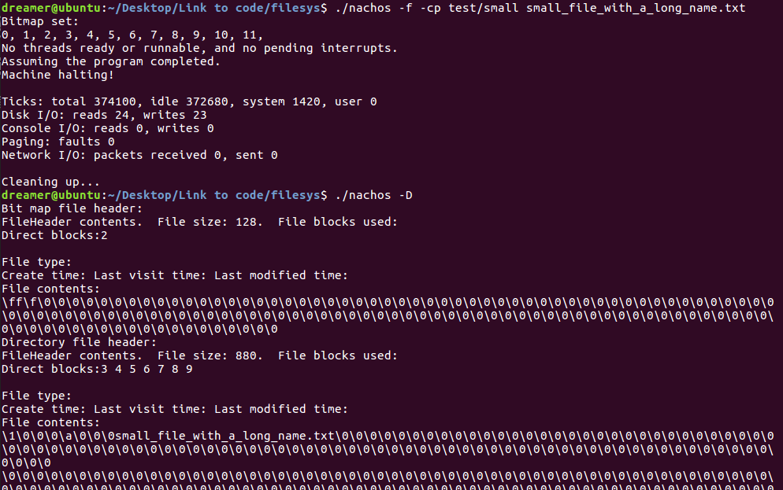

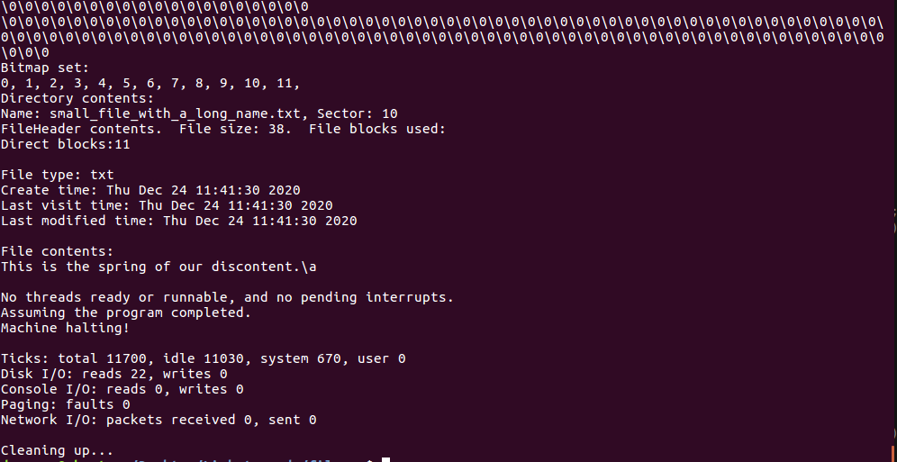

##### Exercise3 扩展文件长度

**改直接索引为间接索引，以突破文件长度不能超过4KB的限制。**

添加上述文件属性之后，直接索引的数量。为了突破文件长度的限制，我把直接索引的最后两项分别改为了二级索引和三级索引（理论上可以将最后一项改为任意级的索引来适应文件的最大长度），这时文件的最大长度就可以达到136064B。

```
#define NumDirect (NumFileSector-2)
#define NumOfFirstIndex (SectorSize/sizeof(int))
#define NumOfSecondIndex (NumOfFirstIndex*NumOfFirstIndex)
#define MaxFileSize ((NumDirect+NumOfFirstIndex+NumOfSecondIndex)*SectorSize)
```

对应修改FileHeader类的成员函数，以Allocate为例

```
bool
FileHeader::Allocate(BitMap *freeMap, int fileSize)
{ 
    numBytes = fileSize;
    numSectors  = divRoundUp(fileSize, SectorSize);
    int numLeft=freeMap->NumClear();
    //printf("%d %d %d %d\n",fileSize,numSectors,MaxFileSize,NumOfFirstIndex);
    if(numSectors<=NumDirect){
        if (numLeft < numSectors)
        return FALSE;		// not enough space

        for (int i = 0; i < numSectors; i++)
            dataSectors[i] = freeMap->Find();
        return TRUE;
    }
    if(numSectors<=NumDirect+NumOfFirstIndex){
        if(numLeft < numSectors+1)
            return FALSE;		// not enough space
        for (int i = 0; i < NumDirect; i++)
            dataSectors[i] = freeMap->Find();
        dataSectors[NumDirect]=freeMap->Find();
        int firstIndex[NumOfFirstIndex];
        for(int i=0;i<numSectors-NumDirect;i++){
            firstIndex[i]=freeMap->Find();
        }
        synchDisk->WriteSector(dataSectors[NumDirect],(char *)firstIndex);
        return TRUE;
    }
    if(numSectors<=NumDirect+NumOfFirstIndex+NumOfSecondIndex){
        int secondSectorNum=numSectors-NumDirect-NumOfFirstIndex;
        int secondIndexNum=(secondSectorNum%NumOfFirstIndex==0?
            secondSectorNum/NumOfFirstIndex:secondSectorNum/NumOfFirstIndex+1);
        //printf("---%d %d",secondSectorNum,secondIndexNum);
        if(numLeft < numSectors+2+secondIndexNum)
            return FALSE;		// not enough space
        for(int i=0;i<=NumDirect;i++){
            dataSectors[i] = freeMap->Find();
            
        }
        dataSectors[NumDirect]=freeMap->Find();
        int firstIndex[NumOfFirstIndex],secondIndex[NumOfFirstIndex];
        for(int i=0;i<NumOfFirstIndex;i++){
            firstIndex[i]=freeMap->Find();
            
        }
        synchDisk->WriteSector(dataSectors[NumDirect],(char *)firstIndex);
        dataSectors[NumDirect+1]=freeMap->Find();
        for(int i=0;i<secondIndexNum;i++){
            firstIndex[i]=freeMap->Find();
            for(int j=0;j<NumOfFirstIndex&&j+i*NumOfFirstIndex<secondSectorNum;j++){
                secondIndex[j]=freeMap->Find();
            }
            synchDisk->WriteSector(firstIndex[i],(char *)secondIndex);
        }
        synchDisk->WriteSector(dataSectors[NumDirect+1],(char *)firstIndex);
        return TRUE;
    }
    ASSERT(FALSE);
}

```

创建长度分别为1216B和32453B的file1和file2，测试如下

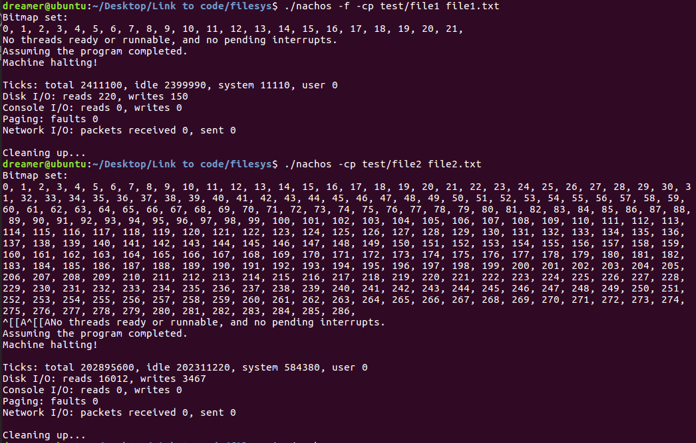

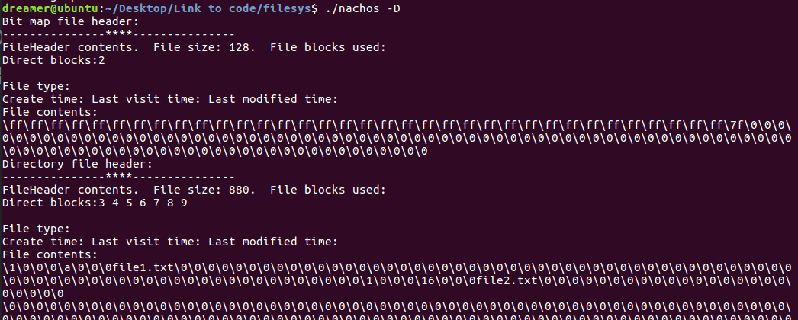

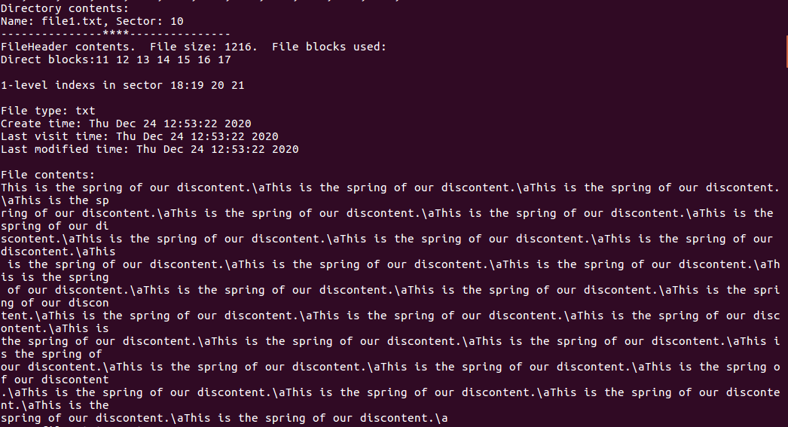

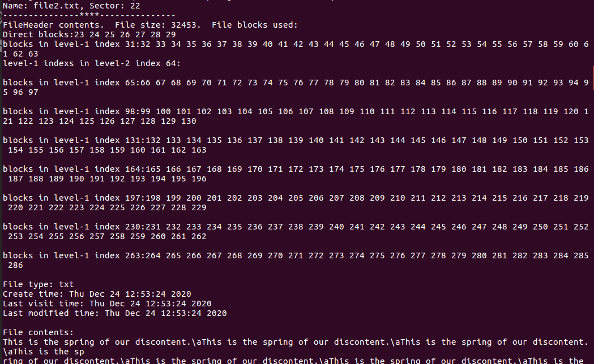

##### Exercise4 实现多级目录

在DirectoryEntry类中添加变量bool isDirectory表示目录项对应的是否为目录文件。

更改FileSystem类的各成员函数以支持绝对路径。在路径进行解析时使用递归函数是很方便的，以Create为例：添加递归函数bool FileSystem::Create(char *name, int initialSize, OpenFile *direcFile)，每次解析name路径的最外层（如果还没有目录就建立相应的目录文件），将剩下路径和当前目录文件作为name、direcFile参数调用递归函数，到最后一层时才创建文件，实现如下。

```
bool
FileSystem::Create(char *name, int initialSize)
{
    Create(name, initialSize, directoryFile);
}

bool
FileSystem::Create(char *name, int initialSize, OpenFile *direcFile)
{
   // printf("--Createing %s %d\n",name,direcFile->oSector);
    Directory *directory;
    BitMap *freeMap;
    FileHeader *hdr;
    int sector;
    bool success;
    
    directory = new Directory(NumDirEntries);
    directory->FetchFrom(direcFile);
    //if(direcFile!=directoryFile) delete direcFile;
    if(name[0]=='/') name++;
    int i;
    bool lastLevel=1;
    for(i=0;name[i]!=0;i++){
        if(name[i]=='/') {
            lastLevel=0;
            break;
        }
    }
    name[i]=0;
    DEBUG('f', "Creating file %s, size %d\n", name, initialSize);
    sector=directory->Find(name);
    if (sector != -1){
        if(lastLevel) return FALSE;			// file is already in directory
        else{
            name[i]='/';
            return Create(name+i+1,initialSize,new OpenFile(sector));;
        }
    }
    else {	
        freeMap = new BitMap(NumSectors);
        freeMap->FetchFrom(freeMapFile);
        sector = freeMap->Find();	// find a sector to hold the file header
    	if (sector == -1) 		
            success = FALSE;		// no free block for file header 
        else if (!directory->Add(name, sector, !lastLevel))
            success = FALSE;	// no space in directory
	else {
    	    hdr = new FileHeader;
            if(lastLevel){
                if (!hdr->Allocate(freeMap, initialSize))
            	    return FALSE;	// no space on disk for data
            }else{
                if (!hdr->Allocate(freeMap, DirectoryFileSize))
            	    return FALSE;	// no space on disk for data
            }
	    
	     {
            
            hdr->setCreateTime();
            hdr->setLastModifiedTime();
            hdr->setLastVisitTime();
            hdr->setType(name);
		// everthing worked, flush all changes back to disk
    	    	hdr->WriteBack(sector); 		
    	    	directory->WriteBack(direcFile);
    	    	freeMap->WriteBack(freeMapFile);
                
            if(lastLevel){
                success=TRUE;
                
            }else{
                OpenFile *opp=new OpenFile(sector);
                Directory *mydirectory = new Directory(NumDirEntries);
                mydirectory->WriteBack(opp);
                
                success=Create(name+i+1,initialSize,opp);
                name[i]='/';
            }
            
	    }
            delete hdr;
	}
        freeMap->Print();
        delete freeMap;
    }
    delete directory;
    
    return success;
}

```

对应的修改Open、Remove、Print、List成员函数，添加ld命令查看目录下的文件，测试如下

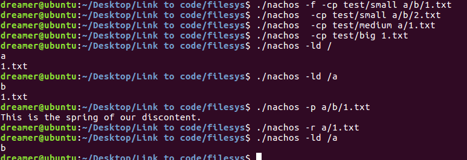

##### Exercise5 动态调整文件长度

**对文件的创建操作和写入操作进行适当修改，以使其符合实习要求。**

在FileHeader类中实现扩展文件长度的成员函数：如果扩展前后扇区数量相同，那么不需要额外空间；否则先释放之前的空间再重新申请。

```
bool
FileHeader::Extend(int num){
    DEBUG('f', "Extend size %d %d\n",numBytes, num);
    BitMap *freeMap=new BitMap(NumSectors);
    fileSystem->GetBitMap(freeMap);
    numBytes+=num;
    if(divRoundUp(numBytes, SectorSize)!=numSectors){
        
        Deallocate(freeMap);
        
        numSectors=divRoundUp(numBytes, SectorSize);
        
        bool is=Allocate(freeMap,numBytes);
        fileSystem->SetBitMap(freeMap);
        return is;
    }
   
    return TRUE;
    
}
```

修改OpenFile类的WriteAt函数：空间不足时调用FileHeader的Extend方法，并将FileHeader写入磁盘。

```
int
OpenFile::WriteAt(char *from, int numBytes, int position)
{
    hdr->FetchFrom(oSector);
    int fileLength = hdr->FileLength();
    int i, firstSector, lastSector, numSectors;
    bool firstAligned, lastAligned;
    char *buf;
    //printf("----%d %d %d\n",position,numBytes,fileLength);
    if ((numBytes <= 0) )
	return 0;				// check request
    if ((position + numBytes) > fileLength){
        hdr->Extend(position + numBytes - fileLength);
        hdr->WriteBack(oSector); 
        //fileSystem->Print();
    }
	
    DEBUG('f', "Writing %d bytes at %d, from file of length %d.\n", 	
			numBytes, position, fileLength);

    firstSector = divRoundDown(position, SectorSize);
    lastSector = divRoundDown(position + numBytes - 1, SectorSize);
    numSectors = 1 + lastSector - firstSector;

    buf = new char[numSectors * SectorSize];

    firstAligned = (position == (firstSector * SectorSize));
    lastAligned = ((position + numBytes) == ((lastSector + 1) * SectorSize));

// read in first and last sector, if they are to be partially modified
    if (!firstAligned)
        ReadAt(buf, SectorSize, firstSector * SectorSize);	
    if (!lastAligned && ((firstSector != lastSector) || firstAligned))
        ReadAt(&buf[(lastSector - firstSector) * SectorSize], 
				SectorSize, lastSector * SectorSize);	

// copy in the bytes we want to change 
    bcopy(from, &buf[position - (firstSector * SectorSize)], numBytes);

// write modified sectors back
    for (i = firstSector; i <= lastSector; i++)	
        synchDisk->WriteSector(hdr->ByteToSector(i * SectorSize), 
					&buf[(i - firstSector) * SectorSize]);
    delete [] buf;
    hdr->setLastModifiedTime();
    hdr->setLastVisitTime();
    return numBytes;
}
```

测试如下

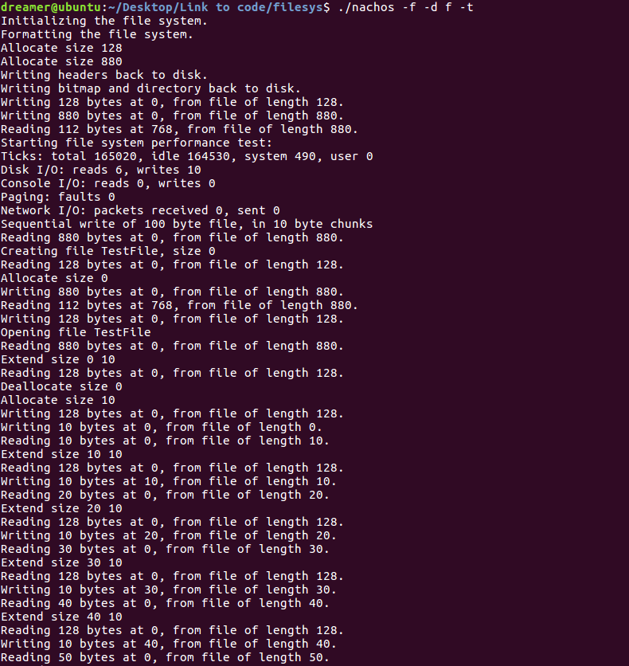

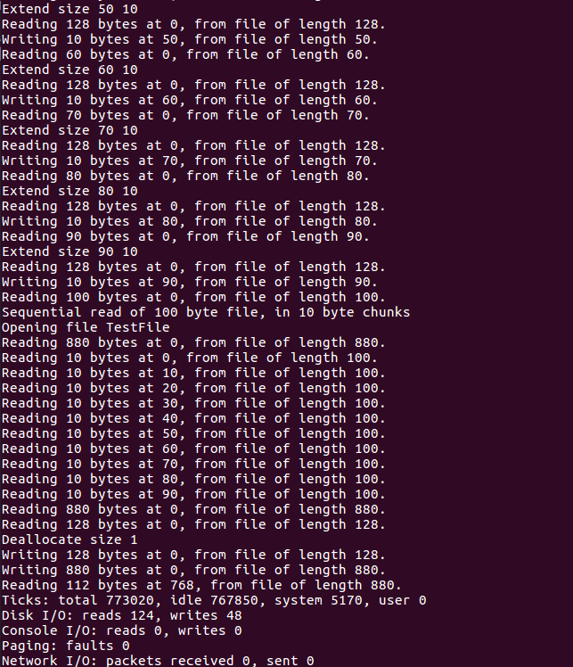

#### 第二部分：文件访问的同步与互斥

##### Exercise6 源代码阅读

**a) 阅读Nachos源代码中与异步磁盘相关的代码，理解Nachos系统中异步访问模拟磁盘的工作原理。**

filesys/synchdisk.h和filesys/synchdisk.cc

> nachos的原始物理磁盘是异步的，发出磁盘请求后会立即返回。当磁盘处理结束后，会通过磁盘中断，来表示任务结束。
>
> 为了实现同步磁盘，首先要增加信号量，发出磁盘请求后执行P操作等待，当磁盘处理结束后，通过V操作通知；考虑到nachos是多线程的，每次只能发出一个请求，所以需要用锁来实现互斥。
>
> - void ReadSector(int sectorNumber, char* data)：读特定扇区,基本流程是获得锁,发出读磁盘相关请求,执行P操作等待磁盘中断，释放锁
>
> - void WriteSector(int sectorNumber, char* data)：写特定扇区,基本流程是获得锁,发出写磁盘相关请求,执行P操作等待磁盘中断，释放锁
>
> - void RequestDone()：处理磁盘中断，基本流程是执行V操作唤醒读/写操作。

**b) 利用异步访问模拟磁盘的工作原理，在Class Console的基础上，实现Class SynchConsole。**

同步Console，实际上就是把Console进行了封装，另外加上锁实现互斥。

```
class SynchConsole {
  public:
    SynchConsole(char *readFile, char *writeFile); 
    ~SynchConsole();                               
    void PutChar(char ch);
    char GetChar(); 
    void WriteDone(); 
    void ReadAvail();
private:
    Console *console;
    Lock *lock;
    Semaphore *semaphoreReadAvail;
    Semaphore *semaphoreWriteDone;
};
static void SynchConsoleReadAvailFunc(int sc)
{
    SynchConsole *console = (SynchConsole *)sc;
    console->ReadAvail();
}
static void SynchConsoleWriteDoneFunc(int sc)
{
    SynchConsole *console = (SynchConsole *)sc;
    console->WriteDone();
}
SynchConsole::SynchConsole(char *readFile, char *writeFile)
{
    lock = new Lock("synch console lock");
    semaphoreReadAvail = new Semaphore("synch console read avail", 0);
    semaphoreWriteDone = new Semaphore("synch console write done", 0);
    console = new Console(readFile, writeFile, SynchConsoleReadAvailFunc, SynchConsoleWriteDoneFunc, (int)this);
}
SynchConsole::~SynchConsole()
{
    delete console;
    delete lock;
    delete semaphoreReadAvail;
    delete semaphoreWriteDone;
}
void SynchConsole::PutChar(char ch)
{
    lock->Acquire();
    console->PutChar(ch);
    semaphoreWriteDone->P();
    lock->Release();
}
char SynchConsole::GetChar()
{
    lock->Acquire();
    semaphoreReadAvail->P();
    char ch = console->GetChar();
    lock->Release();
    return ch;
}
void SynchConsole::WriteDone()
{
    semaphoreWriteDone->V();
}
void SynchConsole::ReadAvail()
{
    semaphoreReadAvail->V();
}
```

测试如下


##### Exercise7 实现文件系统的同步互斥访问机制，达到如下效果：

**a)  一个文件可以同时被多个线程访问。且每个线程独自打开文件，独自拥有一个当前文件访问位置，彼此间不会互相干扰。**

**b)  所有对文件系统的操作必须是原子操作和序列化的。例如，当一个线程正在修改一个文件，而另一个线程正在读取该文件的内容时，读线程要么读出修改过的文件，要么读出原来的文件，不存在不可预计的中间状态。**

**c)  当某一线程欲删除一个文件，而另外一些线程正在访问该文件时，需保证所有线程关闭了这个文件，该文件才被删除。也就是说，只要还有一个线程打开了这个文件，该文件就不能真正地被删除。**

a)当前open函数是每次打开就新建一个OpenFile对象，可以实现一个文件可以同时被多个线程访问且各自有独立的文件访问位置。

b)在SynchDisk中添加读写锁

```
class SynchDisk {
  public:
    void ReadP(int sector);
    void ReadV(int sector);
    void WriteP(int sector);
    void WriteV(int sector);
  private:
    Semaphore *mutex[NumSectors];
    int numReaders[NumSectors];
    Lock *readerLock;
};
void
SynchDisk::ReadP(int sector){
    readerLock->Acquire();
    numReaders[sector]++;
    if(numReaders[sector]==1)
        mutex[sector]->P();
    readerLock->Release();
}

void
SynchDisk::ReadV(int sector){
    readerLock->Acquire();
    numReaders[sector]--;
    if(numReaders[sector]==0)
        mutex[sector]->V();
    readerLock->Release();
}

void
SynchDisk::WriteP(int sector){
    mutex[sector]->P();
}

void
SynchDisk::WriteV(int sector){
    mutex[sector]->V();
}
```

修改OpenFile类的Read和Write函数

```
int OpenFile::Read(char *into, int numBytes)
{
    synchDisk->ReadP(oSector);
    int result = ReadAt(into, numBytes, seekPosition);
    seekPosition += result;
    synchDisk->ReadV(oSector);
    return result;
}

int OpenFile::Write(char *into, int numBytes)
{
    synchDisk->WriteP(oSector);
    int result = WriteAt(into, numBytes, seekPosition);
    seekPosition += result;
    synchDisk->WriteV(oSector);
    return result;
}
```

使用如下函数测试

```
void 
write()
{
    printf("%s start\n", currentThread->getName());
    OpenFile *openFile;    
    int i, numBytes;

    if (!fileSystem->Create(FileName, 0)) {
      printf("Perf test: can't create %s\n", FileName);
      return;
    }
    openFile = fileSystem->Open(FileName);
    if (openFile == NULL) {
    printf("Perf test: unable to open %s\n", FileName);
    return;
    }
    currentThread->Yield();
    printf("begin writing\n");
    numBytes = openFile->Write(Contents, ContentSize);
    printf("end writing\n");
    delete openFile;    // close file
}

void
read(int which){
    printf("%s start\n", currentThread->getName());
    OpenFile *openFile;    
    char *buffer = new char[ContentSize+1];
    int i, numBytes;

    if ((openFile = fileSystem->Open(FileName)) == NULL) {
    printf("Perf test: unable to open file %s\n", FileName);
    delete [] buffer;
    return;
    }
    printf("begin reading\n");
    printf("%s's size is %d\n", FileName,openFile->Length());
    numBytes = openFile->Read(buffer, ContentSize);
    printf("read %d bytes\n", numBytes);
    buffer[ContentSize]='\0';
    printf("read content : %s\n", buffer);
    printf("end reading\n");
    delete [] buffer;
    delete openFile;    // close file

    if (!fileSystem->Remove(FileName)) {
      printf("Perf test: unable to remove %s\n", FileName);
      return;
    }
}

void
PerformanceTest1()
{
    printf("Starting file system performance test:\n");
    Thread* reader=allocThread("reader");
    reader->Fork(read,0);
    write();
}
```

结果如下

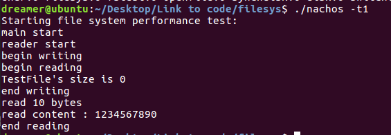

(c)记录每一个文件的打开对象个数，当个数为0时文件才可以删除。

在SynchDisk增加变量

```
int numVisitors[NumSectors];     //访问特定文件的线程数量
```

修改OpenFile的构造函数和析构函数，记录每一个文件的打开对象个数。修改FileSystem的Remove函数。

```
OpenFile::OpenFile(int sector)
{
    synchDisk->numVisitors[oSector]++;
}


OpenFile::~OpenFile()
{
    synchDisk->numVisitors[oSector]--;
}
```

使用如下函数测试

```
void
remove(int which){
    printf("%s want to remove file %s\n", currentThread->getName(),FileName);
    fileSystem->Remove(FileName);
}

void
PerformanceTest2()
{
    printf("Starting file system performance test:\n");
    
    OpenFile *openFile;    
    int i, numBytes;
    
    if (!fileSystem->Create(FileName, 0)) {
      printf("Perf test: can't create %s\n", FileName);
      return;
    }
    openFile = fileSystem->Open(FileName);
    printf("%s using file %s\n", currentThread->getName(),FileName);
    if (openFile == NULL) {
    printf("Perf test: unable to open %s\n", FileName);
    return;
    }
    Thread* remove1=allocThread("remove1");
    remove1->Fork(remove,0);
    printf("begin writing\n");
    
    currentThread->Yield();
    
    numBytes = openFile->Write(Contents, ContentSize);
    
    delete openFile;    // close file
    printf("%s closed file %s\n", currentThread->getName(),FileName);
    Thread* remove2=allocThread("remove2");
    remove2->Fork(remove,0);
}
```

结果如下

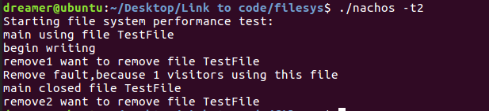

#### 第三部分

##### Challenge 1 性能优化

未完成

##### Challenge 2 实现pipe机制

**重定向openfile的输入输出方式，使得前一进程从控制台读入数据并输出至管道，后一进程从管道读入数据并输出至控制台。**

建立管道文件，两个进程分别进行读、写，测试程序如下

```
void
PerformanceTest3(){
    printf("Starting file system performance test:\n");
    if (!fileSystem->Create(PIPE, SectorSize)) {
      printf("Perf test: can't create %s\n", FileName);
      return;
    }
    Thread* pipewrite=allocThread("pipe write");
    Thread* piperead=allocThread("pipe read");
    pipewrite->Fork(PipeWrite,0);
    piperead->Fork(PipeRead,0);
}
```

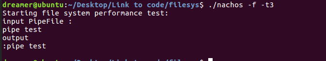

## 内容三：遇到的困难以及解决方法

1. filesys下的Makefile里定义了THREADS，导致参数解析重复。

   > 修改main函数。

2. 写出来的bug太多，肝了很长时间。

## 内容四：收获及感想

这次实验相对复杂。

## 内容五：对课程的意见和建议

无

## 内容六：参考文献

1. [Nachos中文教程 - 百度文库 (baidu.com)](https://wenku.baidu.com/view/47ba36d4d1f34693daef3ed7.html)

